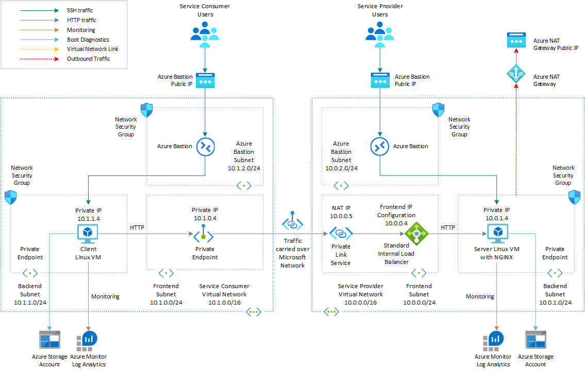
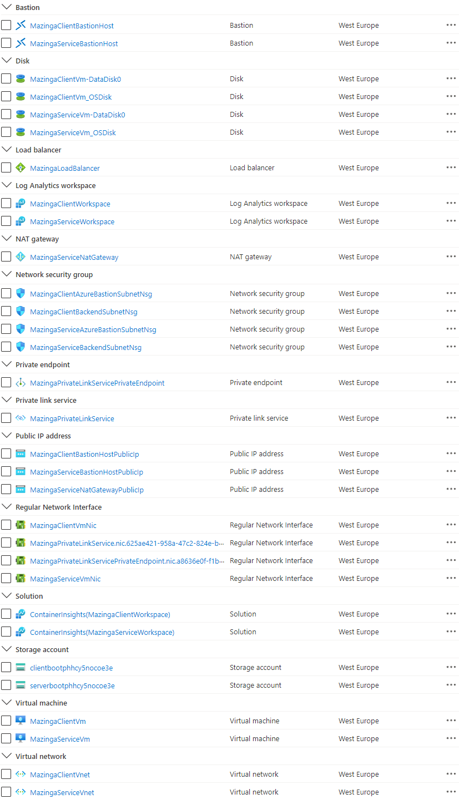
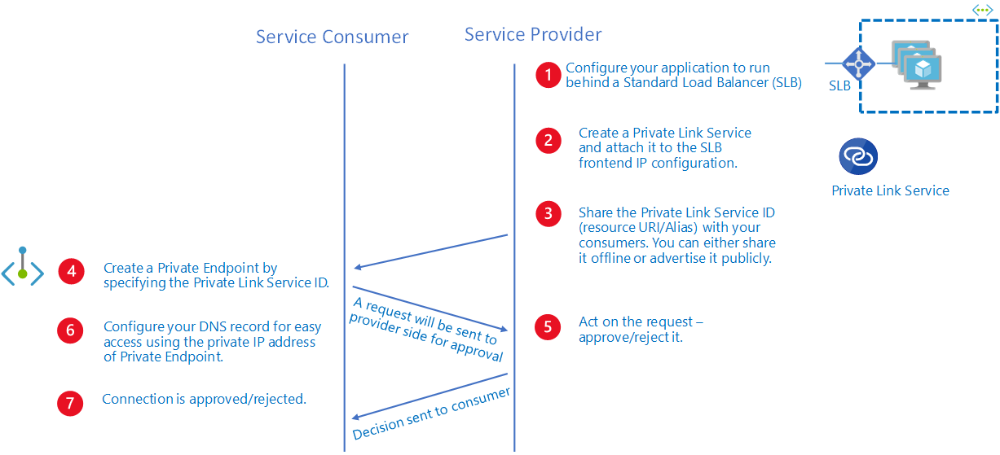

# Create a Private Link Service using Bicep

This sample shows how to use [Bicep](https://docs.microsoft.com/en-us/azure/azure-resource-manager/bicep/overview) to create an [Azure Private Link Service](https://docs.microsoft.com/en-us/azure/private-link/private-link-service-overview) that can be accessed by a third party via an [Azure Private Endpoint](https://docs.microsoft.com/en-us/azure/private-link/private-endpoint-overview). This sample deploys all the Azure resources in the same resource group in the same Azure subscription. In a real-world scenario, service consumer and service provider resources will be hosted distinct Azure subscriptions under the same or a different Azure Active Directory tenant.

## Prerequisites

- An active [Azure subscription](https://docs.microsoft.com/en-us/azure/guides/developer/azure-developer-guide#understanding-accounts-subscriptions-and-billing). If you don't have one, create a [free Azure account](https://azure.microsoft.com/free/) before you begin.
- [Visual Studio Code](https://code.visualstudio.com/) installed on one of the [supported platforms](https://code.visualstudio.com/docs/supporting/requirements#_platforms) along with the [Bicep extension](https://marketplace.visualstudio.com/items?itemName=ms-azuretools.vscode-bicep).

## Architecture

The following picture shows the high-level architecture created by the [Bicep](https://docs.microsoft.com/en-us/azure/azure-resource-manager/bicep/overview) modules included in this sample:



*Figure: network topology and infrastructure architecture.*

Multiple Azure resources are defined in the Bicep modules:

- [Microsoft.Network/virtualNetworks](https://docs.microsoft.com/en-us/azure/templates/microsoft.network/virtualnetworks): the module creates a virtual network for the service provider and one virtual network for the services consumer.
- [Microsoft.Network/loadBalancers](https://docs.microsoft.com/en-us/azure/templates/microsoft.network/loadBalancers): The internal standard load balancer that exposes the virtual machine that hosts the service.
- [Microsoft.Network/networkInterfaces](https://docs.microsoft.com/en-us/azure/templates/microsoft.network/networkinterfaces): the module deploys two network interfaces, one for service provider virtual machine and one for the service consumer virtual machine.
- [Microsoft.Compute/virtualMachines](https://docs.microsoft.com/en-us/azure/templates/microsoft.compute/virtualmachines): There are two virtual machines, one that hosts the service exposed via and one virtual machine that can be used to test the connection to the service via a private endpoint. This virtual machine simulates a third party consumer application and can resides in a separate Azure subscription under a distinct Azure Active Directory tenant. For the sake of simplicity, this demo deploys both virtual machines in the same Azure subscription. By default, this sample deploys two Ubuntu Linux virtual machines, but you can use `imagePublisher`, `imageOffer`, and `imageSku` to select a different operating system or version.
- [Microsoft.Storage/storageAccounts](https://docs.microsoft.com/en-us/azure/templates/microsoft.storage/storageaccounts): this storage account is used to store the boot diagnostics logs of both the service provider and service consumer virtual machines. Boot Diagnostics is a debugging feature which allows you to view Console Output and Screenshot to diagnose virtual machine status. In a real-world scenario, the service provider and service consumer virtual machines would be located in separate subscriptions and should be configured to store the boot diagnostics logs in separate storage accounts. Both virtual machines access the storage account via a private endpoint, one in the service provider virtual network, and one in the service consumer virtual network.
- [Microsoft.Network/bastionHosts](https://docs.microsoft.com/en-us/azure/templates/microsoft.network/bastionhosts): a separate Azure Bastion is deployed in the service provider and service consumer virtual network to provide SSH connectivity to both virtual machines.
- [Microsoft.Compute/virtualMachines/extensions](https://docs.microsoft.com/en-us/azure/templates/Microsoft.Compute/virtualMachines/extensions): The [Azure Custom Script Extension](https://docs.microsoft.com/en-us/azure/virtual-machines/extensions/custom-script-linux) is used on the service provider virtual machine to installs [NGINX](https://www.nginx.com/) web server. The [Log Analytics virtual machine extension for Linux](https://docs.microsoft.com/en-us/azure/virtual-machines/extensions/oms-linux) is installed to both virtual machines to collect diagnostics logs and metrics to a shared [Azure Log Analytics](https://docs.microsoft.com/en-us/azure/azure-monitor/logs/log-analytics-workspace-overview) workspace. In a real-world scenario, the two virtual machines will collect logs and metrics into separate workspaces.
- [Microsoft.OperationalInsights/workspaces](https://docs.microsoft.com/en-us/azure/templates/microsoft.operationalinsights/workspaces): a centralized [Azure Log Analytics](https://docs.microsoft.com/en-us/azure/azure-monitor/logs/log-analytics-workspace-overview) workspace is used to collect the diagnostics logs and metrics from all the Azure resources. In a real-world scenario, the service provider and service consumer may run into separate Azure subscriptions and use separate workspaces.
- [Microsoft.Network/privateLinkServices](https://docs.microsoft.com/en-us/azure/templates/microsoft.network/privateLinkServices): The [Azure Private Link Service](https://docs.microsoft.com/en-us/azure/private-link/private-link-service-overview) used to expose the service, represented in this sample by a sample website hosted by the NGINX web server on the service provider virtual machine.
- [Microsoft.Network/natGateways](https://docs.microsoft.com/en-us/azure/templates/microsoft.network/natgateways?tabs=bicep): Outbound connectivity isn't available for any virtual machine in the backend pool of an internal standard load balancer. A [Virtual Network NAT](https://docs.microsoft.com/en-us/azure/virtual-network/nat-gateway/nat-overview) is created and associated to the backend subnet hosting the service provider virtual machine. A standard Public IP Address is created and associated to the NAT Gateway. With a NAT gateway the service provider virtual machine doesn't need a public IP address to access services via the public internet and can remain private. The Custom Script Extension of the service provider virtual machine needs outbound connectivity to download and execute a bash script that install NGINX locally.
- [Microsoft.Network/publicIpAddresses](https://docs.microsoft.com/en-us/azure/templates/microsoft.network/publicIpAddresses): An [Azure Public IP Address](https://docs.microsoft.com/en-us/azure/virtual-network/ip-services/public-ip-addresses) is created for each Azure Bastion Host and for the NAT Gateway.
- [Microsoft.Network/privateEndpoints](https://docs.microsoft.com/en-us/azure/templates/microsoft.network/privateendpoints): The [Azure Private Endpoint](https://docs.microsoft.com/en-us/azure/private-link/private-endpoint-overview) used to access the service via Azure Private Link. In addition, each virtual network contains a private endpoint to access the shared storage account. In real-world scenario, the service consumer and service provider would run in separate subscriptions, and they would use separate storage accounts for storing the boot diagnostics logs of virtual machines.
- [Microsoft.Network/privateDnsZones](https://docs.microsoft.com/en-us/azure/templates/microsoft.network/privatednszones): an [Azure Private DNS Zone](https://docs.microsoft.com/en-us/azure/dns/private-dns-overview) is used for translating (or resolving) the fully qualified name of the storage account to the private IP address of the two private endpoints, one in the service provider virtual network and one in the service consumer virtual network, using A records.
- [Microsoft.Network/networkSecurityGroups](https://docs.microsoft.com/en-us/azure/templates/microsoft.network/networksecuritygroups?tabs=bicep): subnets hosting virtual machines and Azure Bastion Hosts are protected by [Azure Network Security Groups](https://docs.microsoft.com/en-us/azure/virtual-network/network-security-groups-overview) that are used to filter inbound and outbound traffic.

> **NOTE**  
> You can find the `architecture.vsdx` file used for the diagram under the `visio` folder.

## Deploy the Bicep modules

You can deploy the Bicep modules in the `bicep` folder using either Azure CLI or Azure PowerShell.

### Azure CLI

```azurecli
az group create --name SampleRG --location westeurope
az deployment group create --resource-group SampleRG --template-file main.bicep --parameters vmAdminUsername=<admin-user>
```

### PowerShell

```azurepowershell
New-AzResourceGroup -Name SampleRG -Location westeurope
New-AzResourceGroupDeployment -ResourceGroupName SampleRG -TemplateFile ./main.bicep -vmAdminUsername "<admin-user>"
```

### Bash Script

You can also use the `deploy.sh` bash script under the `bicep` folder to deploy the infrastructure.

```bash
#!/bin/bash

# Template
template="main.bicep"
parameters="main.parameters.json"

# Variables
validateTemplate=1
useWhatIf=1
install=1

# Name and location of the resource group for the Azure Kubernetes Service (AKS) cluster
resourceGroupName="SampleRG"
location="WestEurope"

# Subscription id, subscription name, and tenant id of the current subscription
subscriptionId=$(az account show --query id --output tsv)
subscriptionName=$(az account show --query name --output tsv)
tenantId=$(az account show --query tenantId --output tsv)

# Check if the resource group already exists
echo "Checking if [$resourceGroupName] resource group actually exists in the [$subscriptionName] subscription..."

az group show --name $resourceGroupName &>/dev/null

if [[ $? != 0 ]]; then
  echo "No [$resourceGroupName] resource group actually exists in the [$subscriptionName] subscription"
  echo "Creating [$resourceGroupName] resource group in the [$subscriptionName] subscription..."

  # Create the resource group
  az group create --name $resourceGroupName --location $location 1>/dev/null

  if [[ $? == 0 ]]; then
    echo "[$resourceGroupName] resource group successfully created in the [$subscriptionName] subscription"
  else
    echo "Failed to create [$resourceGroupName] resource group in the [$subscriptionName] subscription"
    exit
  fi
else
  echo "[$resourceGroupName] resource group already exists in the [$subscriptionName] subscription"
fi

# Validate the Bicep template
if [[ $validateTemplate == 1 ]]; then
  if [[ $useWhatIf == 1 ]]; then
    # Execute a deployment What-If operation at resource group scope.
    echo "Previewing changes deployed by [$template] Bicep template..."
    az deployment group what-if \
      --resource-group $resourceGroupName \
      --template-file $template \
      --parameters $parameters

    if [[ $? == 0 ]]; then
      echo "[$template] Bicep template validation succeeded"
    else
      echo "Failed to validate [$template] Bicep template"
      exit
    fi
  else
    # Validate the Bicep template
    echo "Validating [$template] Bicep template..."
    output=$(az deployment group validate \
      --resource-group $resourceGroupName \
      --template-file $template \
      --parameters $parameters)

    if [[ $? == 0 ]]; then
      echo "[$template] Bicep template validation succeeded"
    else
      echo "Failed to validate [$template] Bicep template"
      echo $output
      exit
    fi
  fi
fi

# Deploy the Bicep template
if [[ $install == 1 ]]; then
  echo "Deploying [$template] Bicep template..."
  az deployment group create \
    --resource-group $resourceGroupName \
    --only-show-errors \
    --template-file $template \
    --parameters $parameters 1>/dev/null

  if [[ $? == 0 ]]; then
    echo "[$template] Bicep template successfully provisioned"
  else
    echo "Failed to provision the [$template] Bicep template"
    exit
  fi
fi
```

> **NOTE**  
> Make sure to specify a value for the following parameters in the `main.parameters.json` file:
>
> - `prefix`: specifies a prefix for all the Azure resources.
> - `authenticationType`: specifies the type of authentication when accessing the Virtual Machine. SSH key is recommended. Allowed values: `sshPublicKey` and `password`.
> - `vmAdminUsername`: specifies the name of the administrator account of the virtual machine.
> - `vmAdminPasswordOrKey`: specifies the SSH Key or password for the virtual machine. SSH key is recommended. We suggest reading the password or SSH Key from Key Vault. For more information, see [Use Azure Key Vault to pass secure parameter value during Bicep deployment](https://docs.microsoft.com/en-us/azure/azure-resource-manager/bicep/key-vault-parameter?tabs=azure-cli).

## Review deployed resources

Use the Azure portal, Azure CLI, or Azure PowerShell to list the deployed resources in the resource group.

### Azure CLI

```azurecli
az resource list --resource-group SampleRG
```

### PowerShell

```azurepowershell
Get-AzResource -ResourceGroupName SampleRG
```

### Azure Portal



*Figure: Azure Resources in the resource group.*

### Connect to the Service Consumer VM via Bastion

Connect to to service consumer virtual machine via Bastion from the Azure portal as follows:

1. In the Azure portal the service consumer virtual network called *Prefix*ClientVm.
2. Select `Connect` on the `Overview` page.
3. Select `Bastion` from the drop-down list.
4. Specify the `Username`. `Authentication Type`, and `Password` or `SSH Private Key`.
5. Click the `Connect` button.

### Access the HTTP service privately from the service consumer VM

Here's how to connect to the http service from the VM by using the private endpoint.

1. Open the MazingaPrivateLinkServicePrivateEndpoint.nic.*GUID* network interface associated to the private endpoint.
2. Read the `Private IP address` in the `Overview` page.
3. Run the `curl <private IP address>` command.

If everything works as expected, you should see a response message like the following returned by the NGINX website hosted by the service provider virtual machine via [Azure Private Link service](https://docs.microsoft.com/en-us/azure/private-link/private-link-service-overview).

```bash
azadmin@MazingaClientVm:~$ curl 10.1.0.4
Hello World from host MazingaServiceVm !
```

## Clean up resources

When you no longer need the resources that you created with the private link service, delete the resource group. This will remove all the Azure resources.

## What is Bicep?

[Bicep](https://docs.microsoft.com/en-us/azure/azure-resource-manager/bicep/overview) is a domain-specific language (DSL) that uses declarative syntax to deploy Azure resources. It provides concise syntax, reliable type safety, and support for code reuse. Bicep offers the best authoring experience for your infrastructure-as-code solutions in Azure.

## What is Azure Private Link service?

[Azure Private Link service](https://docs.microsoft.com/en-us/azure/private-link/private-link-service-overview) is the reference to your own service that is powered by Azure Private Link. Your service that is running behind [Azure Standard Load Balancer](https://docs.microsoft.com/en-us/azure/load-balancer/load-balancer-overview) can be enabled for Private Link access so that consumers to your service can access it privately from their own VNets. Your customers can create a private endpoint inside their VNet and map it to this service. This article explains concepts related to the service provider side.


*Figure: Azure Private Link Service.*

## Workflow

Assuming that the user deploying the solution has `Owner` or `Contributor` role on the resource group or subscription, the private link connection in this sample will be automatically approved. In a real-world scenario, the private endpoint connection will need to be approved by the service provider. For more information, see the approval workflow under [Azure Private Link service](https://docs.microsoft.com/en-us/azure/private-link/private-link-service-overview) .



*Figure: Azure Private Link service workflow.*

### Create your Private Link Service

- Configure your application to run behind a standard load balancer in your virtual network. If you already have your application configured behind a standard load balancer, you can skip this step.
- Create a Private Link Service referencing the load balancer above. In the load balancer selection process, choose the frontend IP configuration where you want to receive the traffic. Choose a subnet for NAT IP addresses for the Private Link Service. It is recommended to have at least eight NAT IP addresses available in the subnet. All consumer traffic will appear to originate from this pool of private IP addresses to the service provider. Choose the appropriate properties/settings for the Private Link Service.

> [!NOTE]
> Azure Private Link Service is only supported on Standard Load Balancer.

### Share your service

After you create a Private Link service, Azure will generate a globally unique named moniker called "alias" based on the name you provide for your service. You can share either the alias or resource URI of your service with your customers offline. Consumers can start a Private Link connection using the alias or the resource URI.

### Manage your connection requests

After a consumer initiates a connection, the service provider can accept or reject the connection request. All connection requests will be listed under the `privateendpointconnections` property on the Private Link service. On the Azure portal, you can see select the `Private endpoint connections` tab under the Azure Private Link service ro see all pending or approved private endpoint connections.  

## Limitations

The following are the known limitations when using the Private Link service:

- Supported only on Standard Load Balancer. Not supported on Basic Load Balancer.
- Supported only on Standard Load Balancer where backend pool is configured by NIC when using VM/VMSS.
- Supports IPv4 traffic only
- Supports TCP and UDP traffic only

## Next steps

- [Create a private link service using Azure PowerShell](https://docs.microsoft.com/en-us/azure/private-link/create-private-link-service-powershell)
- [Create a private link service using Azure CLI](https://docs.microsoft.com/en-us/azure/private-link/create-private-link-service-cli)
